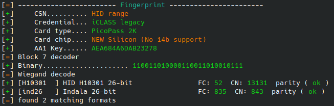

# Proxmark3 Cheatsheet
Iceman fork
## HID
**iClass**

 - Display card info:  ``` hf iclass info ```

 Look for fingerprint -> Legacy = cloneable , SE = try downgrade attack, SEOS = not cloneable.
 
 - Check whether card is elite keyed:

 Elite key output example:

 

 Non-elite key output example:
 
 
 - Many legacy cards use default keys. Try to dump cards using default keys:
 Non-elite key: ```hf iclass dump --ki <0,1,2,3>```
 Elite key: ```hf iclass dump --ki <0,1,2,3>``` --elite
 - Try dictionary attack if non-default keys are used:
 Non-elite key: ```hf iclass chk -f iclass_default_keys.dic```
Elite key:  ```hf iclass chk -f iclass_elite_keys.dic --elite```
To dump card with new keys, use ```-k <insert keys>``` instead of ```--ki 0```
