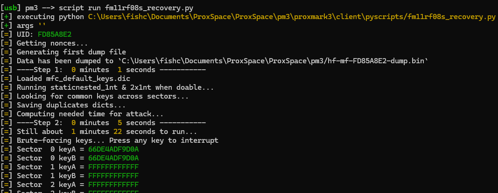

# Mifare Cheatsheet

### USCUID
- Check for genuine USCUID:
hf 14a raw -akb 7 40; hf 14a raw -k 43; hf 14a raw -c 3800
- Recover Fudan based MFC1K keys
Often only 30 or 31 keys out of 32 can be found using autopwn. ```hf mf info``` will let you know if it is a fudan based tag.

Last few keys can be found by sniffing reader, or using fudan recovery script:
```script run fm11rf08s_recovery.py``` 

